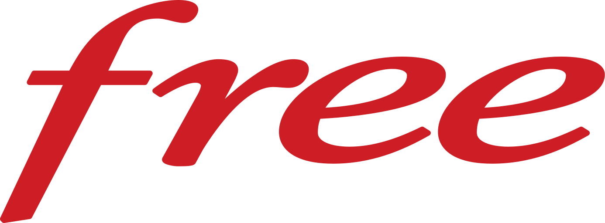

# MynetworK - Dashboard réseau multi-sources

<div align="center">


[](https://github.com/erreur32/mynetwork/pkgs/container/mynetwork)
[](https://github.com/Erreur32/MynetworK/actions/workflows/docker-publish.yml)
[](https://github.com/Erreur32/MynetworK/security/code-scanning)
[](https://scorecard.dev/viewer/?uri=github.com/Erreur32/MynetworK)


[](https://github.com/Erreur32/MynetworK/pkgs/container/mynetwork)

<h1 align="center">MynetworK</h1>
<p align="center">
  Gestion unifiée Freebox + UniFi.
</p>

**📖 [Read in English](README.md)**

---

<p align="center">
  <sub>Powered by</sub><br/>
  
  &nbsp;&nbsp;
  
</p>


**Un dashboard multi-sources moderne pour gérer Freebox, UniFi et vos réseaux**

[Installation](#installation) | [Fonctionnalités](#-principales-fonctionnalités) | [Configuration](#configuration) | [Documentation](#-documentation)

</div>

---

> **Version DEV** - Ce projet est en cours de développement actif. Des bugs peuvent être présents et certaines fonctionnalités peuvent ne pas fonctionner comme prévu.

## Vue d'ensemble

**MynetworK** est un dashboard unifié permettant de gérer et surveiller plusieurs sources de données réseau local via :

- **Freebox** - Gestion complète de votre Freebox (Ultra, Delta, Pop)
- **UniFi Controller** - Surveillance et gestion de votre infrastructure UniFi
- **Scan Réseau** - Détection et analyse des appareils réseau avec détection automatique des vendors

<details>
<summary>Cliquez pour voir l'image</summary>


</details>


### ✨ Principales fonctionnalités

- 🔐 **Authentification utilisateur** - Système JWT avec gestion des rôles (admin, user, viewer)
- 🔌 **Système de plugins** - Architecture modulaire pour ajouter facilement de nouvelles sources
- 📊 **Dashboard unifié** - Visualisation centralisée des données de tous les plugins
- 📝 **Logging complet** - Traçabilité de toutes les actions avec filtres avancés
- 👥 **Gestion des utilisateurs** - Interface d'administration pour gérer les accès
- 🐳 **Docker Ready** - Déploiement simplifié avec Docker Compose
- 🌐 **Internationalisation (i18n)** - Anglais (par défaut) et français ; sélecteur de langue dans l'en-tête. Voir [Docs/INTERNATIONALIZATION.md](Docs/INTERNATIONALIZATION.md).

## Installation

### Prérequis

- Docker et Docker Compose
- Accès au réseau local pour Freebox/UniFi

### docker-compose.yml

```yaml
services:
  mynetwork:
    image: ghcr.io/erreur32/mynetwork:latest
    restart: unless-stopped

    ports:
      # Port externe du dashboard (par défaut : 7505)
      - "${DASHBOARD_PORT:-7505}:3000"

    environment:
      # 🔐 SECRET OBLIGATOIRE (aucun fallback en production)
      JWT_SECRET: ${JWT_SECRET}

      # Configuration
      CONFIG_FILE_PATH: ${CONFIG_FILE_PATH:-/app/config/mynetwork.conf}
      FREEBOX_HOST: ${FREEBOX_HOST:-mafreebox.freebox.fr}
      FREEBOX_TOKEN_FILE: /app/data/freebox_token.json

      # Accès métriques host
      HOST_ROOT_PATH: ${HOST_ROOT_PATH:-/host}

      # PUBLIC_URL (optionnel, uniquement avec reverse proxy)
      # PUBLIC_URL: https://dashboard.example.com

    volumes:
      # Données persistantes (token Freebox, base locale, etc.)
      - ./data:/app/data

      # Métriques hôte (lecture seule) — CPU, RAM, réseau, table ARP, hostname
      - /proc:/host/proc:ro
      - /sys:/host/sys:ro
      - /etc/hostname:/host/etc/hostname:ro
      - /etc/hosts:/host/etc/hosts:ro

    # Capacités réseau pour le scan (ping / ARP)
    cap_add:
      - NET_RAW
      - NET_ADMIN
      - SETUID
      - SETGID
    cap_drop:
      - ALL

    healthcheck:
      test: ["CMD", "wget", "--no-verbose", "--tries=1", "--spider", "http://127.0.0.1:3000/api/health"]
      interval: 30s
      timeout: 10s
      retries: 3
      start_period: 40s

```

**Lancement :**

```bash
# Lancer avec Docker Compose
docker-compose up -d

# Voir les logs
docker-compose logs -f

# Arrêter
docker-compose down

# Mettre à jour l'image
docker-compose pull
docker-compose up -d
```

**✅ Recommandation :** Utilisez le **fichier [.env](#configuration-sécurisée-de-jwt_secret)** à la racine. Docker Compose le lit automatiquement et injecte `JWT_SECRET` dans le conteneur.

> 💡 **Plus d'infos :** Consultez la section [🔒 Configuration sécurisée de JWT_SECRET](#configuration-sécurisée-de-jwt_secret) pour les méthodes de configuration, bonnes pratiques et vérification.

Le dashboard sera accessible sur :
- **http://localhost:7505** - depuis la machine hôte
- **http://IP_DU_SERVEUR:7505** - depuis un autre appareil du réseau

<details>
<summary><strong>⚙️ Configuration avancée</strong></summary>

### Optionnel : Fichier de configuration externe (`.conf`)

1. **Créer le fichier :**
   ```bash
   cp config/mynetwork.conf.example config/mynetwork.conf
   # Éditez config/mynetwork.conf selon vos besoins
   ```

2. **Monter dans Docker :** Décommentez dans `docker-compose.yml` :
   ```yaml
   volumes:
     - mynetwork_data:/app/data
     - ./config/mynetwork.conf:/app/config/mynetwork.conf:ro
   ```

3. **Synchronisation :** Au démarrage, si le `.conf` existe → import en base ; sinon → export de la config actuelle.

4. **API :** `GET /api/config/export`, `POST /api/config/import`, `GET /api/config/file`, `POST /api/config/sync`.

#### Nginx (reverse proxy)

Sans nginx : pas de `PUBLIC_URL`. Avec nginx : définir `PUBLIC_URL` (ex. `http://mynetwork.example.com`). Voir `Docs/nginx.example.conf` pour un exemple complet.

</details>

<details id="configuration-sécurisée-de-jwt_secret">
<summary><strong>🔒 Configuration sécurisée de JWT_SECRET</strong></summary>

**⚠️ CRITIQUE :** Le secret JWT par défaut est pour le **développement** uniquement. En production, définir une variable d'environnement `JWT_SECRET` unique et robuste.

#### Pourquoi c'est important ?

Le `JWT_SECRET` signe et vérifie les tokens JWT. Un secret faible permet à un attaquant de forger des tokens, d'accéder au système sans authentification et de modifier les permissions.

#### Méthodes (recommandation)

**1. Fichier `.env` à la racine (recommandé)**

1. Générer un secret : `openssl rand -base64 32`
2. Créer `.env` :
   ```bash
   JWT_SECRET=votre_secret_ici_minimum_32_caracteres
   DASHBOARD_PORT=7505
   FREEBOX_HOST=mafreebox.freebox.fr
   PUBLIC_URL=https://mynetwork.example.com
   ```
3. Restreindre : `chmod 600 .env`
4. Démarrer : `docker-compose up -d`

**2. Fichier personnalisé :** `docker-compose --env-file .env.production up -d`

#### Vérification

```bash
docker-compose logs | grep -i "jwt\|secret"
```

Dans l'interface : **Administration > Sécurité** → section « Configuration JWT ».

#### Bonnes pratiques

- Longueur minimale 32 caractères (64 recommandé)
- Caractères aléatoires, unicité par instance
- `.env` en `chmod 600`, dans `.gitignore`
- Rotation régulière (6–12 mois) ou en cas de compromission

#### Rotation du secret

1. Nouveau secret : `openssl rand -base64 32`
2. Mettre à jour `.env` : `JWT_SECRET=nouveau_secret`
3. Redémarrer : `docker-compose restart`
4. Tous les utilisateurs devront se reconnecter.

</details>


## Première connexion

1. Accédez au dashboard (http://localhost:7505 ou votre IP).
2. Identifiants par défaut : **Username** `admin`, **Password** `admin123`.
3. ⚠️ **Changez le mot de passe immédiatement après la première connexion !**
4. Configurez vos plugins dans la page **Plugins**.

<details>
<summary><strong>🎨 Fonctionnalités</strong></summary>

### Dashboard principal
- **Statistiques multi-sources** - Données unifiées de tous les plugins
- **Graphiques en temps réel** - Débits, connexions, statistiques
- **Vue d'ensemble réseau** - État global de l'infrastructure

### Gestion des plugins
- **Configuration centralisée** - Interface par plugin
- **Activation / Désactivation** - Contrôle de chaque source
- **Statut de connexion** - État de chaque plugin

### Freebox (plugin)
- **Dashboard complet** - WiFi, LAN, Téléchargements, VMs, TV, Téléphone
- **Compatibilité** - Ultra, Delta, Pop
- **API native** - API officielle Freebox OS

### UniFi Controller (plugin)
- **Surveillance réseau** - AP, clients, trafic
- **Multi-sites** - Plusieurs sites UniFi
- **Données en temps réel** - Mise à jour automatique
- **Dual API** - Controller local et Site Manager API (cloud)
- **Badges de stats** - Stats système dans l'en-tête

### Scan Réseau (plugin)
- **Détection automatique** - Scan complet (IP, MAC, hostnames)
- **Détection vendors** - Fabricants via base Wireshark, Freebox/UniFi ou API
- **Scan automatique** - Scans périodiques (full + refresh)
- **Historique** - Évolution des appareils avec graphiques
- **Base Wireshark** - Intégration `manuf` et mise à jour auto
- **Priorité** - Ordre hostname/vendor (Freebox, UniFi, Scanner)
- **Interface** - Tableau interactif, tri, filtres, recherche, édition inline

### Gestion des utilisateurs (admin)
- **CRUD** - Création, modification, suppression
- **Rôles** - admin, user, viewer
- **Sécurité** - Mots de passe hashés (bcrypt)

### Logs d'activité (admin)
- **Traçabilité** - Toutes les actions enregistrées
- **Filtres** - Par utilisateur, plugin, action, niveau, période
- **Export** - À venir

</details>

<details>
<summary><strong>🏗️ Architecture</strong></summary>

- **Frontend React** (TypeScript) - Interface utilisateur
- **Backend Express** (TypeScript) - API REST et WebSocket
- **SQLite** - Configurations et données
- **Système de plugins** - Architecture extensible

Voir [DEV/ARCHITECTURE_PLUGINS.md](DEV/ARCHITECTURE_PLUGINS.md).

</details>

<details>
<summary><strong>📚 Documentation</strong></summary>

### Utilisateurs
- **[CHANGELOG.md](CHANGELOG.md)** - Journal des changements

### Développeurs
**[DEV/README-DEV.md](DEV/README-DEV.md)** - Documentation de développement.

- **[DEV/DOCUMENTATION.md](DEV/DOCUMENTATION.md)** - Index
- **[DEV/GUIDE_DEVELOPPEMENT.md](DEV/GUIDE_DEVELOPPEMENT.md)** - Guide développeurs
- **[DEV/ARCHITECTURE_PLUGINS.md](DEV/ARCHITECTURE_PLUGINS.md)** - Architecture plugins

**Dossier Docs ([Docs/](Docs/))** : Guides d’installation et de production (UniFi, Freebox, variables d’environnement, Nginx, dépannage, réinitialisation). Les principaux documents existent en **anglais** et en **français** (voir [Docs/README.md](Docs/README.md)).

</details>

## Sécurité

- **Authentification JWT** - Tokens sécurisés avec expiration
- **Hash des mots de passe** - bcrypt
- **Middleware d'authentification** - Protection des routes sensibles
- **Logging** - Traçabilité
- **Rôles** - Permissions granulaires

## Contribution

Les contributions sont les bienvenues. Respectez le style de code (4 espaces, camelCase, commentaires en anglais), ajoutez des types TypeScript et documentez les nouvelles fonctionnalités.

## Licence

Ce projet est sous licence MIT. Voir [LICENSE](LICENSE).

## Remerciements

- **Projet original :** [FreeboxOS-Ultra-Dashboard](https://github.com/HGHugo/FreeboxOS-Ultra-Dashboard) par [HGHugo](https://github.com/HGHugo)
- [Free](https://www.free.fr), [Freebox SDK](https://dev.freebox.fr), [Ubiquiti](https://www.ui.com), et la communauté open source

---

<div align="center">

**Fait avec ❤️ pour la gestion multi-sources de réseaux**

**MynetworK - Dashboard réseau multi-sources**

</div>
