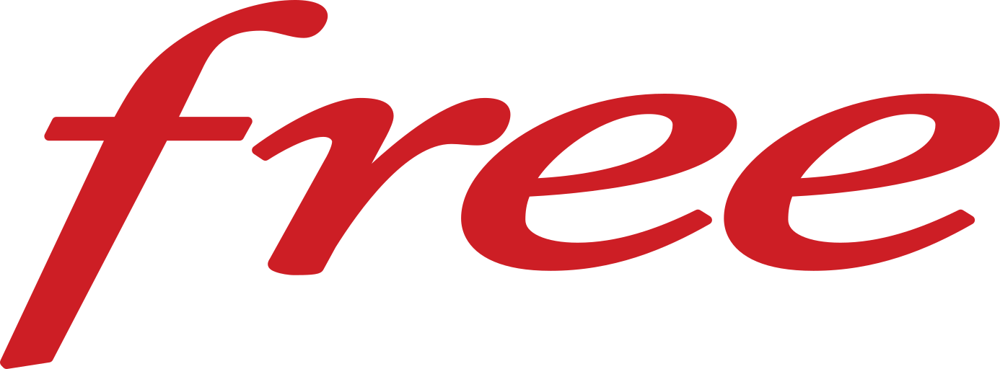

# MynetworK - Dashboard réseau multi-sources

<div align="center">


[](https://github.com/Erreur32/MynetworK/pkgs/container/mynetwork)


[](https://scorecard.dev/viewer/?uri=github.com/Erreur32/MynetworK)
[](https://github.com/Erreur32/MynetworK/security/code-scanning)
[](https://sonarcloud.io/summary/overall?id=Erreur32_MynetworK)
[](https://sonarcloud.io/summary/overall?id=Erreur32_MynetworK)
[](https://sonarcloud.io/summary/overall?id=Erreur32_MynetworK)
[](https://sonarcloud.io/summary/overall?id=Erreur32_MynetworK)
[](https://github.com/Erreur32/MynetworK/actions/workflows/docker-publish.yml)
[](https://github.com/Erreur32/MynetworK/actions/workflows/snyk.yml)


<h1 align="center">MynetworK</h1>
<p align="center">
  Gestion unifiée Freebox + UniFi + Scanner réseau.
</p>

**📖 [Read in English](README.md)**


<p align="center">
  <sub>Powered by</sub><br/>
  
  &nbsp;&nbsp;
  
</p>

**Un dashboard réseau multi-sources pour gérer Freebox, UniFi et le Scanner réseau**

[Installation](#installation) | [Fonctionnalités](#fonctionnalités) | [Configuration](#configuration) | [MCP](#mcp-model-context-protocol) | [Home Assistant](#home-assistant)

</div>


---


## Vue d'ensemble

**MynetworK** est un dashboard unifié permettant de gérer et surveiller plusieurs sources de données réseau local :


- **Freebox** - Gestion complète de votre Freebox (Ultra, Delta, Pop)
- **UniFi Controller** - Surveillance et gestion de votre infrastructure UniFi
- **Scan Réseau** - Détection et analyse des appareils réseau avec détection automatique des fabricants


## Fonctionnalités

- 🔐 **Authentification utilisateur** - Système JWT avec gestion des rôles (admin, user, viewer)
- 🔌 **Système de plugins** - Architecture modulaire pour ajouter facilement de nouvelles sources
- 📊 **Dashboard unifié** - Visualisation centralisée des données de tous les plugins
- 📝 **Logging complet** - Traçabilité de toutes les actions avec filtres avancés
- 👥 **Gestion des utilisateurs** - Interface d'administration pour gérer les accès
- 🐳 **Docker Ready** - Déploiement simplifié avec Docker Compose
- 🌐 **Internationalisation (i18n)** - Anglais (par défaut) et français ; sélecteur de langue dans l'en-tête. Voir [Docs/INTERNATIONALIZATION.md](Docs/INTERNATIONALIZATION.md).
- 🤖 **Serveur MCP** - Serveur [Model Context Protocol](https://modelcontextprotocol.io) natif pour Freebox, UniFi et le scanner réseau, réseau local uniquement. Voir [MCP](#mcp-model-context-protocol) plus bas.

> [!TIP]
>  
> <details>
> <summary> 🖼️ Cliquez pour voir d'autres captures</summary>
> 
> 
>
> 
>
> 
>
> 
> 
> </details>

 
> [!NOTE]
> Une version dédiée et **pleinement fonctionnelle** pour **Home Assistant** est disponible ici :   [https://github.com/Erreur32/HA_mynetwork](https://github.com/Erreur32/HA_mynetwork)
> 


## Installation

### Prérequis

- Docker et Docker Compose
- Accès au réseau local pour Freebox/UniFi

### docker-compose.yml

```yaml
services:
  mynetwork:
    image: ghcr.io/erreur32/mynetwork:latest
    restart: unless-stopped

    ports:
      # Port externe du dashboard (par défaut : 7505)
      - "${DASHBOARD_PORT:-7505}:3000"

    environment:
      # Secret obligatoire (aucun fallback en production)
      JWT_SECRET: ${JWT_SECRET}

      # Configuration
      CONFIG_FILE_PATH: ${CONFIG_FILE_PATH:-/app/config/mynetwork.conf}
      FREEBOX_HOST: ${FREEBOX_HOST:-mafreebox.freebox.fr}
      FREEBOX_TOKEN_FILE: /app/data/freebox_token.json

      # Accès aux métriques de l'hôte
      HOST_ROOT_PATH: ${HOST_ROOT_PATH:-/host}

      # PUBLIC_URL (optionnel, uniquement avec reverse proxy)
      # PUBLIC_URL: https://dashboard.example.com

    volumes:
      # Données persistantes (token Freebox, base locale, etc.)
      - ./data:/app/data

      # Métriques de l'hôte (lecture seule) — CPU, RAM, réseau, table ARP, hostname
      - /proc:/host/proc:ro
      - /sys:/host/sys:ro
      - /etc/hostname:/host/etc/hostname:ro
      - /etc/hosts:/host/etc/hosts:ro

    # Capacités réseau pour le scan (ping / ARP)
    cap_add:
      - NET_RAW
      - NET_ADMIN
      - SETUID
      - SETGID
    cap_drop:
      - ALL

    healthcheck:
      test: ["CMD", "wget", "--no-verbose", "--tries=1", "--spider", "http://127.0.0.1:3000/api/health"]
      interval: 30s
      timeout: 10s
      retries: 3
      start_period: 40s

```

> [!IMPORTANT]
> **Changement majeur v0.7.80 :** Les volumes Docker ont changé. Les montages `/:/host:ro` et `docker.sock` ont été retirés pour raisons de sécurité. Voir le [CHANGELOG](CHANGELOG.md#0780---2026-04-15) pour les instructions de migration.

**Lancement :**

```bash
# Démarrer avec Docker Compose
docker-compose up -d

# Voir les logs
docker-compose logs -f

# Arrêter
docker-compose down

# Mettre à jour l'image
docker-compose pull
docker-compose up -d
```

**Recommandation :** Utilisez le **[fichier .env](#configuration-sécurisée-de-jwt_secret)** (`.env` à la racine du projet) ; Docker Compose le lit automatiquement et injecte `JWT_SECRET` dans le conteneur.

> Pour plus de détails, voir la section [Configuration sécurisée de JWT_SECRET](#configuration-sécurisée-de-jwt_secret) pour toutes les méthodes de configuration, les bonnes pratiques de sécurité et la vérification.

Le dashboard sera accessible sur :
- **http://localhost:7505** - depuis la machine hôte
- **http://IP_DU_SERVEUR:7505** - depuis un autre appareil du réseau

<details>
<summary><strong>Configuration avancée</strong></summary>

### Optionnel : Fichier de configuration externe (`.conf`)

Vous pouvez utiliser un fichier `.conf` externe pour la configuration :

1. **Créer le fichier de config :**
   ```bash
   cp config/mynetwork.conf.example config/mynetwork.conf
   # Éditez config/mynetwork.conf selon vos besoins
   ```

2. **Monter le fichier dans Docker :**  
   Décommentez la ligne dans `docker-compose.yml` :
   ```yaml
   volumes:
     - mynetwork_data:/app/data
     - ./config/mynetwork.conf:/app/config/mynetwork.conf:ro
   ```

3. **Synchronisation automatique :**
   - Au démarrage, si le fichier `.conf` existe → import en base de données
   - Si le fichier n'existe pas → export de la configuration actuelle

4. **Endpoints API :**
   - `GET /api/config/export` - Exporter la configuration actuelle
   - `POST /api/config/import` - Importer depuis le fichier
   - `GET /api/config/file` - Vérifier le statut du fichier
   - `POST /api/config/sync` - Synchronisation manuelle

#### Nginx (reverse proxy)

Si vous utilisez **nginx** comme reverse proxy devant MynetworK, définissez `PUBLIC_URL` avec l'URL publique (via nginx), pas l'URL du conteneur Docker.

**Cas 1 : Sans nginx (accès direct)**  
Pas besoin de `PUBLIC_URL`. L'application fonctionne sur le port mappé (ex. `http://VOTRE_IP:7505`).

**Cas 2 : Avec nginx (reverse proxy)**

1. **Config nginx :** Voir `Docs/nginx.example.conf` pour un exemple complet.
2. **docker-compose.yml :**
   ```yaml
   environment:
     - PUBLIC_URL=http://mynetwork.example.com
     # Ou avec HTTPS :
     # - PUBLIC_URL=https://mynetwork.example.com
   ```
3. **Exemple nginx minimal :**
   ```nginx
   server {
       listen 80;
       server_name mynetwork.example.com;
       location / {
           proxy_pass http://192.168.1.150:7505;
           proxy_http_version 1.1;
           proxy_set_header Upgrade $http_upgrade;
           proxy_set_header Connection 'upgrade';
           proxy_set_header Host $host;
           proxy_set_header X-Real-IP $remote_addr;
           proxy_set_header X-Forwarded-For $proxy_add_x_forwarded_for;
           proxy_set_header X-Forwarded-Proto $scheme;
           proxy_cache_bypass $http_upgrade;
       }
   }
   ```
4. **Avantages de nginx :** SSL/HTTPS (ex. Let's Encrypt), plusieurs services sur un même serveur, cache, URLs propres.

Voir `Docs/nginx.example.conf` pour une configuration HTTP/HTTPS complète.

</details>

<details id="configuration-sécurisée-de-jwt_secret">
<summary><strong>Configuration sécurisée de JWT_SECRET</strong></summary>

**Critique - Sécurité :** Le secret JWT par défaut (`change-me-in-production-please-use-strong-secret`) est réservé au **développement**. En production, vous **devez** définir la variable d'environnement `JWT_SECRET` avec une valeur unique et robuste.

#### Pourquoi c'est important

`JWT_SECRET` sert à signer et vérifier les tokens JWT d'authentification. Un secret faible ou par défaut permet à un attaquant de :
- Forger des JWT valides et usurper l'identité de n'importe quel utilisateur
- Accéder au système sans authentification (accès admin complet)
- Compromettre tous les utilisateurs et leurs données
- Modifier les permissions et accéder aux fonctionnalités restreintes

#### Où c'est utilisé

`JWT_SECRET` est chargé au démarrage du serveur dans `server/services/authService.ts` depuis `process.env.JWT_SECRET`. S'il n'est pas défini, la valeur par défaut est utilisée et un avertissement est loggé. Le secret sert à signer les tokens à la connexion et à les vérifier sur les requêtes authentifiées.

## Dépendances et chaîne d'approvisionnement

MynetworK tourne entièrement sur votre machine et ne communique qu'avec les équipements réseau que vous configurez (Freebox / UniFi / votre LAN). L'application n'envoie jamais de données vers un serveur tiers. La liste complète des paquets npm utilisés est dans [`package.json`](./package.json) ; voici ce qu'il est important de savoir.

### Runtime — backend (Node / Express)

| Paquet | Utilisé pour | Notes |
| --- | --- | --- |
| `express` | Serveur HTTP | Stable, largement audité |
| `helmet` | En-têtes de sécurité (CSP, HSTS, X-Frame-Options…) | Défense en profondeur |
| `express-rate-limit` | Limitation des routes API et d'écriture, compatible IPv6 | |
| `compression` | Compression gzip des réponses | |
| `cors` | Règles CORS | Configuration restrictive par défaut |
| `bcrypt` | Hachage des mots de passe | |
| `jsonwebtoken` | Émission / vérification des JWT | Voir `JWT_SECRET` ci-dessus |
| `better-sqlite3` | Base de données locale (données, sessions, scans, snapshots de topologie, placements manuels) | Le fichier de base se trouve dans le volume monté `./data` — à sauvegarder comme n'importe quelle base |
| `node-cron` | Rafraîchissement quotidien de la topologie + scans planifiés | Local uniquement, aucun accès internet |
| `ws` | WebSockets pour les mises à jour temps réel de l'UI | Écoute sur le même port que le serveur HTTP |

### Runtime — frontend (React / Vite)

| Paquet | Utilisé pour | Notes |
| --- | --- | --- |
| `react` / `react-dom` | Framework UI | |
| `react-router-dom` | Routage côté client | |
| `zustand` | Gestion d'état | |
| `i18next` / `react-i18next` | Traductions anglais / français | |
| `recharts` | Graphiques en barres / lignes du dashboard | Amène `d3-shape`, `d3-scale`, `d3-array`, etc. en dépendances transitives |
| `@xyflow/react` (React Flow) | Graphe de topologie interactif (`/topology`) | Amène `d3-zoom`, `d3-drag`, `d3-selection`, `d3-interpolate` |
| `dagre` | Disposition arborescente/hiérarchique de la topologie | |
| `html-to-image` | Export PNG / SVG de la topologie | Entièrement dans le navigateur, aucun upload |
| `jspdf` | Export PDF de la topologie (A4, raster) | Navigateur uniquement |
| `lucide-react` | Icônes | |
| `react-markdown` + `remark-gfm` | Affichage du changelog dans l'app | Assaini |
| `leaflet` + `leaflet.markercluster` | Vue carte | |
| `sonner` | Notifications toast | |

### Considérations de sécurité

- **Aucune télémétrie.** Aucun de ces paquets ne contacte un serveur tiers pendant l'exécution de l'application. Le conteneur Docker n'a pas besoin d'accès internet sortant pour fonctionner — il ne contacte que les équipements de votre LAN que vous configurez.
- **Librairies d'export (`html-to-image`, `jspdf`)** sont 100 % côté client. Les fichiers PNG / PDF / SVG générés restent dans votre navigateur, rien n'est envoyé.
- **Stack topologie (`@xyflow/react`, `dagre`)** s'exécute dans le navigateur et sur un snapshot SQLite. Le snapshot ne contient que des données déjà accessibles à vos plugins actifs (équipements Freebox / UniFi de votre LAN).
- **Stack graphiques (`recharts`)** n'affiche que des données locales.
- **Chaîne d'approvisionnement.** Dependabot est activé sur ce dépôt et propose des mises à jour hebdomadaires. Snyk tourne à chaque push (`Snyk Security` en CI). SonarCloud tourne à chaque push pour signaler les changements suspects.
- **Builds reproductibles.** `package-lock.json` est versionné. L'image Docker publiée est construite depuis un commit taggé par GitHub Actions (workflow `Build & Push Docker Image`) et poussée sur GHCR, ce qui permet de vérifier ce qui tourne réellement.
- **Mise à jour.** Récupérez la nouvelle image depuis GHCR (`docker compose pull && docker compose up -d`). La version en cours d'exécution est affichée dans le pied de page de l'UI et au démarrage dans les logs du conteneur.

Si vous découvrez une faille de sécurité, merci d'ouvrir une alerte de sécurité privée GitHub plutôt qu'une issue publique.

## Configuration 

#### Méthodes de configuration (ordre recommandé)

##### 1. **Fichier `.env` (recommandé pour la production)**

Docker Compose lit automatiquement `.env` à la racine du projet.

1. **Générer un secret robuste** (au moins 32 caractères) :
   ```bash
   # Linux/macOS :
   openssl rand -base64 32
   
   # Windows PowerShell :
   [Convert]::ToBase64String((1..32 | ForEach-Object { Get-Random -Maximum 256 }))
   ```

2. **Créer un fichier `.env`** à la racine du projet :
   ```bash
   # .env
   JWT_SECRET=votre_secret_genere_minimum_32_caracteres
   
   DASHBOARD_PORT=7505
   FREEBOX_HOST=mafreebox.freebox.fr
   PUBLIC_URL=https://mynetwork.example.com
   ```

3. **Restreindre les permissions :**
   ```bash
   chmod 600 .env
   ```

4. **Démarrer avec Docker Compose :**
   ```bash
   docker-compose up -d
   ```

##### 2. **`.env` avec `--env-file`**

```bash
echo "JWT_SECRET=$(openssl rand -base64 32)" > .env.production
docker-compose --env-file .env.production up -d
```

#### Vérification

Après le démarrage, vérifiez qu'un secret personnalisé est utilisé :

```bash
docker-compose logs | grep -i "jwt\|secret"
```

Si vous voyez un avertissement comme : *"Using default JWT secret. Please set JWT_SECRET..."*, alors `JWT_SECRET` n'a pas été correctement défini.

**Dans l'interface web :** Administration → Sécurité → la section « Configuration JWT » indique si le secret par défaut est utilisé.

#### Bonnes pratiques de sécurité

1. **Longueur :** Au moins **32 caractères** (64 recommandé)
2. **Aléatoire :** Utilisez des données aléatoires, pas des mots de passe prévisibles
3. **Unicité :** Chaque instance de production doit avoir son propre secret
4. **Stockage :** Restreignez les permissions de `.env` (`chmod 600`), ajoutez `.env` au `.gitignore`, utilisez un gestionnaire de secrets pour les déploiements critiques
5. **Rotation :** Changez le secret périodiquement (ex. tous les 6-12 mois) ou en cas de suspicion de compromission
6. **Dev vs prod :** Utilisez des secrets différents pour le développement et la production

#### Rotation du secret JWT

1. Générer un nouveau secret : `openssl rand -base64 32`
2. Mettre à jour `.env` : `JWT_SECRET=nouveau_secret`
3. Redémarrer : `docker-compose restart`
4. Tous les utilisateurs devront se reconnecter (les tokens existants sont invalidés).

#### Exemple de `.env`

```bash
# .env – Production

JWT_SECRET=votre_secret_genere_par_openssl

DASHBOARD_PORT=7505
FREEBOX_HOST=mafreebox.freebox.fr
PUBLIC_URL=https://mynetwork.example.com
```

</details>


## Première connexion

1. Ouvrez le dashboard (http://localhost:7505 ou l'IP de votre serveur).
2. Connectez-vous avec les identifiants par défaut :
   - **Utilisateur :** `admin`
   - **Mot de passe :** `admin123`
3. **Changez le mot de passe immédiatement après la première connexion.**
4. Configurez vos plugins dans la page **Plugins**.

<details>
<summary><strong>Fonctionnalités</strong></summary>

### Dashboard principal
- **Statistiques multi-sources** - Vue unifiée des données de tous les plugins
- **Graphiques en temps réel** - Débits, connexions, statistiques
- **Vue d'ensemble réseau** - État global de votre infrastructure

### Gestion des plugins
- **Configuration centralisée** - Interface pour configurer chaque plugin
- **Activation/désactivation** - Contrôle fin de chaque source de données
- **Statut de connexion** - Vérifier l'état de chaque plugin

### Freebox (plugin)
- **Dashboard complet** - Toutes les fonctionnalités Freebox (WiFi, LAN, Téléchargements, VMs, TV, Téléphone)
- **Compatibilité** - Ultra, Delta, Pop
- **API native** - API officielle Freebox OS

### UniFi Controller (plugin)
- **Surveillance réseau** - Stats des AP, clients, trafic
- **Multi-sites** - Plusieurs sites UniFi
- **Données temps réel** - Mise à jour automatique des statistiques
- **Dual API** - Controller local (node-unifi) et Site Manager API (cloud)
- **Badges de stats** - Statistiques système dans l'en-tête (débit, uptime, équipements)

### Scan Réseau (plugin)
- **Découverte automatique** - Scan complet du réseau local (IPs, MAC, hostnames)
- **Détection de fabricant** - Identification automatique du fabricant (base Wireshark, Freebox/UniFi, ou API externe)
- **Scans planifiés** - Scan complet et rafraîchissement périodiques
- **Historique** - Évolution des équipements dans le temps avec graphiques
- **Base de fabricants Wireshark** - Intégration complète avec `manuf` de Wireshark et mise à jour auto
- **Système de priorité** - Ordre de détection hostname/fabricant (Freebox, UniFi, Scanner)
- **Interface moderne** - Tableau interactif avec tri, filtres, recherche et édition inline du hostname

### Gestion des utilisateurs (admin)
- **CRUD complet** - Créer, modifier, supprimer des utilisateurs
- **Rôles** - Permissions (admin, user, viewer)
- **Sécurité** - Mots de passe hashés avec bcrypt

### Logs d'activité (admin)
- **Traçabilité complète** - Toutes les actions sont loggées
- **Filtres avancés** - Par utilisateur, plugin, action, niveau, période
- **Export** - Export des logs (prévu)

</details>

<details>
<summary><strong>Architecture</strong></summary>

MynetworK utilise une architecture modulaire :
- **Frontend React** (TypeScript) - Interface utilisateur moderne
- **Backend Express** (TypeScript) - API REST et WebSocket
- **Base de données SQLite** - Stockage de la configuration et des données
- **Système de plugins** - Architecture extensible pour de nouvelles sources de données

Voir [DEV/ARCHITECTURE_PLUGINS.md](DEV/ARCHITECTURE_PLUGINS.md) pour les détails.

</details>

<details>
<summary><strong>Documentation</strong></summary>

### Pour les utilisateurs
- **[CHANGELOG.md](CHANGELOG.md)** - Journal des changements et nouvelles fonctionnalités

### Pour les développeurs
Voir **[DEV/README-DEV.md](DEV/README-DEV.md)** pour la documentation de développement.

**Documents principaux :**
- **[DEV/DOCUMENTATION.md](DEV/DOCUMENTATION.md)** - Index de la documentation
- **[DEV/GUIDE_DEVELOPPEMENT.md](DEV/GUIDE_DEVELOPPEMENT.md)** - Guide développeur
- **[DEV/ARCHITECTURE_PLUGINS.md](DEV/ARCHITECTURE_PLUGINS.md)** - Architecture des plugins

**Dossier Docs ([Docs/](Docs/)) :** Guides d'installation et de production (UniFi, Freebox, variables d'environnement, Nginx, dépannage, réinitialisation). Les principaux documents existent en **anglais** et en **français** (voir [Docs/README.md](Docs/README.md)).

</details>

## Home Assistant

> [!IMPORTANT]
> Une version dédiée et **pleinement fonctionnelle** pour **Home Assistant** est disponible :  
> [](https://github.com/Erreur32/HA_mynetwork)  
> 
> - **Intégration HACS** prête à l'emploi
> - Support **Add-on**
> - **Optimisé** pour HA Supervisor/Docker
> - **Auto-découverte** des réseaux Freebox/UniFi

Voir le [dépôt HA](https://github.com/Erreur32/HA_mynetwork) pour l'installation.


## MCP (Model Context Protocol)

MynetworK embarque un serveur [MCP](https://modelcontextprotocol.io) natif : un client MCP (Claude Desktop, Claude Code...) peut ainsi interroger et piloter directement votre Freebox, votre contrôleur UniFi et le scanner réseau, sans passer par l'interface web.

- **Réseau local uniquement** - non exposé via le reverse proxy ; protégé par une liste blanche d'IP (RFC1918 + loopback) en plus d'un jeton dédié
- **Jeton dédié** - distinct de la session JWT web, généré uniquement en ligne de commande (jamais depuis le panneau admin, potentiellement exposé sur internet, alors que l'endpoint MCP doit rester strictement local)
- **Statut en lecture seule dans l'UI admin** - l'onglet "MCP" affiche l'état (activé/désactivé), si un jeton est configuré, l'endpoint et la dernière utilisation, ainsi que ces mêmes instructions de configuration avec copie en un clic ; le jeton lui-même n'est jamais affiché

### 1. Générer le jeton d'accès

À exécuter sur le serveur. Affiche le jeton une seule fois : il n'est jamais réaffiché, ni stocké quelque part de consultable.

```bash
# Docker (production, déploiement par défaut, nom du conteneur : "mynetwork")
docker exec -it -u node mynetwork npm run mcp:token

# Local / dev (npm run dev sans conteneur)
npm run mcp:token
```

Le `-u node` est important : sans lui, `docker exec` s'exécute sous un autre utilisateur que le process de l'appli (qui possède le fichier de base de données), et échoue avec une erreur SQLite "readonly database" (le jeton s'affiche mais n'est en réalité jamais enregistré). Relancer cette commande renouvelle le jeton et révoque immédiatement l'ancien.

### 2. Connecter un client

Le serveur parle le transport standard MCP **Streamable HTTP** à l'adresse `http://<IP-LAN>:<PORT>/api/mcp` : remplacez l'IP LAN, le port et le jeton affichés ci-dessus dans l'exemple du client voulu.

**Claude Code (CLI)**

```bash
claude mcp add --transport http mynetwork http://<IP-LAN>:<PORT>/api/mcp \
  --header "Authorization: Bearer <jeton>"
```

Ou dans le `.mcp.json` d'un projet :

```json
{
  "mcpServers": {
    "mynetwork": {
      "type": "http",
      "url": "http://<IP-LAN>:<PORT>/api/mcp",
      "headers": { "Authorization": "Bearer <jeton>" }
    }
  }
}
```

**Claude Desktop**

Les plans payants (Pro/Max/Team/Enterprise) peuvent l'ajouter directement dans Réglages → Connecteurs, qui parle nativement Streamable HTTP. Sur le plan gratuit, ou pour tout client limité au stdio, faites le pont avec [`mcp-remote`](https://www.npmjs.com/package/mcp-remote) dans `claude_desktop_config.json` :

```json
{
  "mcpServers": {
    "mynetwork": {
      "command": "npx",
      "args": [
        "mcp-remote@latest",
        "http://<IP-LAN>:<PORT>/api/mcp",
        "--header",
        "Authorization: Bearer <jeton>"
      ]
    }
  }
}
```

**Autres agents / clients**

Tout client MCP supportant Streamable HTTP (Cursor, Continue, agents maison basés sur le SDK MCP...) n'a besoin que de l'URL et de l'en-tête bearer ci-dessus. Pour un client limité au stdio, le même pont `mcp-remote` que pour Claude Desktop s'applique.

### Outils disponibles

| Source | Lecture | Écriture |
|---|---|---|
| **Freebox** | infos système, statut connexion, WiFi/stations, hôtes LAN, config/baux DHCP, ports switch, journal d'appels, contacts | reboot, activer/désactiver WiFi/BSS, ajouter un bail DHCP statique |
| **UniFi** | équipements, clients, WLANs, config réseau, règles de redirection de ports, rapport de bande passante, infos système, sites | bloquer/débloquer un client, activer/désactiver un WLAN, redémarrer un équipement |
| **Scanner réseau** | statistiques, équipements, équipement par IP, liste noire | lancer/relancer un scan, ajouter une IP manuellement, renommer un hôte, ajouter/retirer de la liste noire |

Les actions d'écriture se limitent à des opérations non destructives (aucune suppression de données), même si certaines restent disruptives par nature (un reboot ou un redémarrage coupe brièvement la connectivité — les descriptions des outils l'indiquent explicitement).

### Exemples

À quoi ressemble un appel d'outil depuis un client MCP, et le type de réponse obtenue (les valeurs ci-dessous sont illustratives, pas de vraies données).

**Freebox — lecture : quels appareils sont actuellement en WiFi**

```
> freebox_get_wifi_stations
```
```json
{
  "success": true,
  "result": [
    {
      "mac": "AA:BB:CC:11:22:33",
      "hostname": "laptop-julien",
      "ip": "192.168.1.42",
      "band": "5G",
      "rssi": -52,
      "connected_since": 3841
    },
    {
      "mac": "AA:BB:CC:44:55:66",
      "hostname": "iphone-julien",
      "ip": "192.168.1.57",
      "band": "2G4",
      "rssi": -67,
      "connected_since": 120
    }
  ]
}
```

**UniFi — écriture : bloquer un client du réseau**

```
> unifi_block_client { "mac": "AA:BB:CC:77:88:99" }
```
```json
{
  "success": true,
  "result": {
    "mac": "AA:BB:CC:77:88:99",
    "blocked": true
  }
}
```

## Sécurité

- **Authentification JWT** - Tokens sécurisés avec expiration
- **Hash des mots de passe** - bcrypt avec salt rounds
- **Middleware d'authentification** - Protection des routes sensibles
- **Logging des actions** - Traçabilité complète
- **Accès basé sur les rôles** - Permissions granulaires

## Contribution

Les contributions sont les bienvenues.

### Recommandations

- Respectez le style de code existant (4 espaces, camelCase, commentaires en anglais)
- Ajoutez des types TypeScript pour le nouveau code
- Testez les changements avant de soumettre
- Documentez les nouvelles fonctionnalités
- Respectez les fichiers de règles du projet

## Licence

Ce projet est sous licence MIT. Voir [LICENSE](LICENSE) pour plus de détails.

## Remerciements

### Projet original

Ce projet s'inspire fortement de **Freebox OS Ultra Dashboard** par [HGHugo](https://github.com/HGHugo/FreeboxOS-Ultra-Dashboard). Merci à l'auteur original pour ce travail qui a servi de base à MynetworK.

**Projet original :** [FreeboxOS-Ultra-Dashboard](https://github.com/HGHugo/FreeboxOS-Ultra-Dashboard)

### Autres

- [Free](https://www.free.fr) pour la Freebox et son API ouverte
- [Freebox SDK](https://dev.freebox.fr) pour la documentation de l'API
- [Ubiquiti](https://www.ui.com) pour UniFi
- La communauté open source pour les librairies utilisées

---

<div align="center">

**Fait avec ❤️ pour la gestion réseau multi-sources**

**MynetworK - Dashboard réseau multi-sources**

</div>
